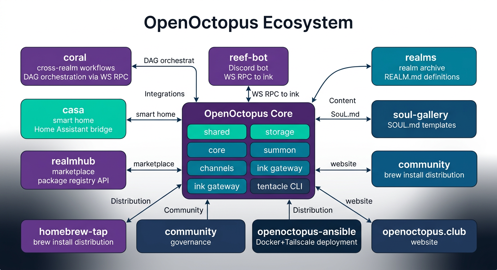
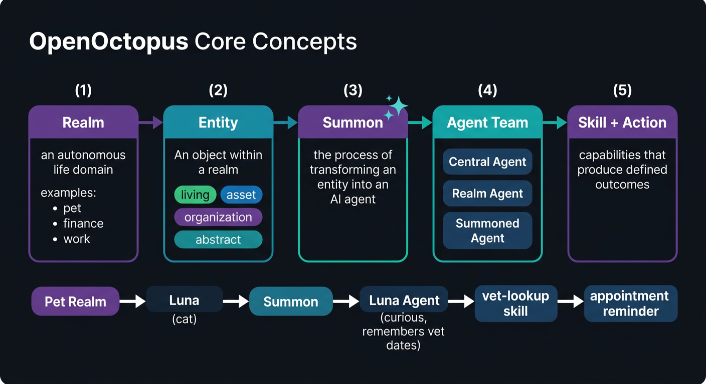

  

<h3 align="center">AI Family Home Hub — one event, every member, the right context. 🐙</h3>

  
  
  

---

**OpenOctopus** is an **AI family home hub**. It organizes family life into **Realms** — pet, parents, finance, work, health — each with its own knowledge base, agent team, and skill set. The same event reaches every family member with role-appropriate context: dad gets action items, mom gets coordination view, grandpa gets large-text essentials, kids get simplified info.

**The killer feature: [Summon](https://openoctopus.club/#summon).** Turn any real-world entity — your dog, your mom, your car — into a living AI agent with memory, personality, and proactive behavior. It lives in your family group chat, not another app to install.

  

### 🐙 Projects

| Repo | Phase | Description |
|------|-------|-------------|
| **[openoctopus](https://github.com/open-octopus/openoctopus)** | 1 | Core monorepo — shared, storage, core, summon, channels, ink, tentacle |
| **[coral](https://github.com/open-octopus/coral)** | 1 | Family event routing engine — cross-realm intelligent coordination |
| **[realms](https://github.com/open-octopus/realms)** | 1 | Official realm packages (Phase 1: pet + parents) |
| **[soul-gallery](https://github.com/open-octopus/soul-gallery)** | 1 | Community SOUL.md template gallery |
| **[openoctopus.club](https://github.com/open-octopus/openoctopus.club)** | 1 | Landing page — Astro + Tailwind CSS |
| **[reef-bot](https://github.com/open-octopus/reef-bot)** | 1 | Discord community bot |
| **[mcp-discord](https://github.com/open-octopus/mcp-discord)** | 1 | Discord MCP server for agent environments |
| **[community](https://github.com/open-octopus/community)** | 1 | The Reef — community policies & docs |
| **[openoctopus-ansible](https://github.com/open-octopus/openoctopus-ansible)** | 2 | Self-hosted deployment (Raspberry Pi) |
| **[casa](https://github.com/open-octopus/casa)** | 2 | Smart home integration (Home Assistant) |
| **[realmhub](https://github.com/open-octopus/realmhub)** | 3 | Realm package marketplace |
| **[homebrew-tap](https://github.com/open-octopus/homebrew-tap)** | 3 | `brew install openoctopus` |

### ✦ Core Concepts

  

- **Realm** — Autonomous life domain (like an octopus tentacle with its own nerve center)
- **Entity** — Object within a realm (living, asset, organization, abstract)
- **Summon** — Transform an entity into a living AI agent with memory & personality
- **Agent** — Three tiers: Central, Realm, and Summoned
- **Skill** — Global skills + Realm-scoped skills

### 🌊 Get Involved

- ⭐ Star [the core repo](https://github.com/open-octopus/openoctopus)
- 💬 Join [The Reef (Discord)](https://discord.gg/mwNTk8g5fV)
- 🐦 Follow [@openoctopus](https://x.com/openoctopus) on X

Eight arms. Every family member covered. Your data, your tentacles.

